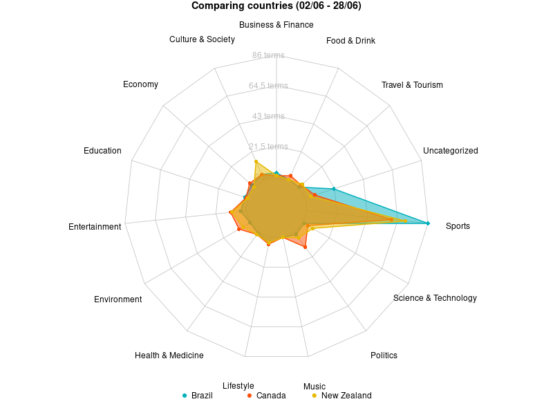

# Worldwide Trends

## Project Overview

This project analyzes data collected from the Google Trends public dataset using Google BigQuery. The analysis is performed using OpenAI API, and the results are presented in an interactive map created with JSVectorMap.

## Project Structure

- `extract-dataset-bq.r`: The script that collects the data from Google BigQuery.
- `classification.r`: The script that performs the data classification with OpenAI.
- `analysis.r`: Performs the aggregation and visualization of the data.
- `/out`: Directory containing the output CSV file generated by the R scripts.
- `/utils`: Scripts containing common functionalities.
- `/reports`: The reports generated by the scripts.
- `/site`: App to display the interactive map using JSVectorMap. [IN PROGRESS]

## Prerequisites

- R
- Google Cloud account and project
- OpenAI API Key
- Web browser

## Setup and Usage Instructions

1. Clone the repository to your local machine.
2. Ensure you have the necessary prerequisites installed.
3. Setup the .Renviron variables with your values.
4. Execute the following files, in order:
    - `extract-dataset-bq.r`
    - `classification.r`
    - `analysis.r`
5. Checkout the CSV outputs in the `/out` directory.
6. Checkout the reports at `/reports`.
7. Open `maps/index.html` in a web browser to view the interactive map. [IN PROGRESS]

## Results

### Countries comparison

### Complete comparison

You can view the complete comparison in the [PDF report](reports/radar-countries-complete.pdf).

## License

This project is licensed under the MIT License.
